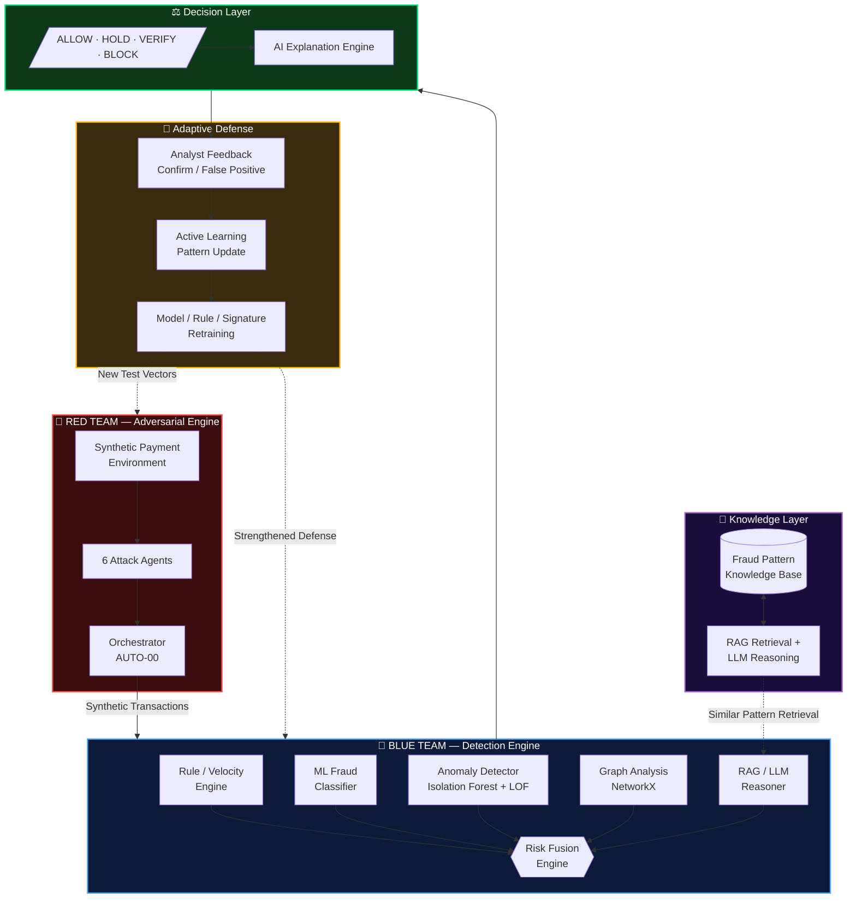
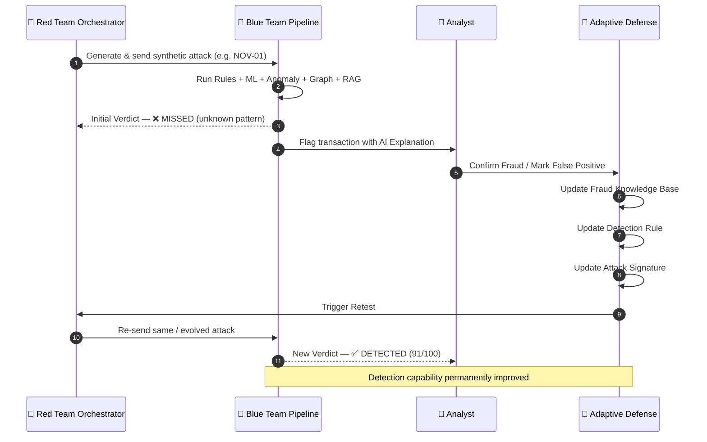
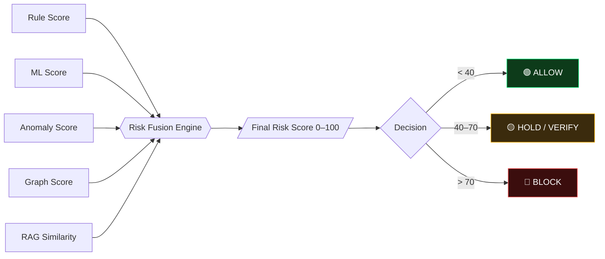

<div align="center">


<br/>


<br/><br/>

[](https://git.io/typing-svg)

<br/>

Frontend Codename: **VectorGuard AI Dashboard** &nbsp;·&nbsp; Core Engine: **SentinelPay AI**

<br/>


<br/>


</div>

<br/>

---

## 📡 Transmission Log — Table of Contents

- [Mission Briefing](#-mission-briefing)
- [The Core Innovation](#-the-core-innovation)
- [System Architecture](#-system-architecture)
- [The Adversarial Feedback Loop](#-the-adversarial-feedback-loop)
- [🔴 Red Team — Attack Agent Roster](#-red-team--attack-agent-roster)
- [🔵 Blue Team — Detection Layer Stack](#-blue-team--detection-layer-stack)
- [Risk Fusion & Decisioning](#-risk-fusion--decisioning)
- [Command Center Dashboard](#️-command-center-dashboard)
- [API Surface](#-api-surface)
- [Technology Stack](#-technology-stack)
- [Getting Started](#-getting-started)
- [The Squad](#-the-squad)
- [Roadmap](#-roadmap)
- [License](#-license)

---

## 🎯 Mission Briefing

> Traditional fraud detection systems lean on **static rules** and **previously known attack signatures**. The moment an adversary mutates their behaviour or invents something new, that defense goes blind.

**SentinelPay AI** flips the model. Instead of passively waiting to be attacked, the system **attacks itself, continuously** — an autonomous Red Team generates evolving synthetic fraud, an independent Blue Team detects and explains it, and an adaptive feedback loop closes the gap between the two, cycle after cycle.

```
   Attack  →  Detection  →  Evaluation  →  Learning  →  Defense Improvement  →  Retest
```

This isn't detection. It's **defense-in-depth that gets sharper every time it's tested.**

---

## 💡 The Core Innovation

<div align="center">

| ❌ Conventional Fraud Detection | ✅ SentinelPay AI |
|:---|:---|
| Single ML model, static thresholds | Rules + ML + Anomaly Detection + Graph + RAG/LLM, fused |
| Blind to zero-day / novel patterns | Purpose-built Novelty Agent to probe unknown blind spots |
| Detect → done | Detect → Explain → Feedback → **Adapt** → Retest |
| Black-box risk scores | Human-readable AI explanations, per decision |
| Manually curated test cases | Autonomous adversarial simulation, 24/7 |

</div>

> **One-line USP:**
> *"A fraud-defense system that doesn't just detect attacks — it attacks itself to discover and improve its own blind spots."*

---

## 🏗 System Architecture



---

## 🔁 The Adversarial Feedback Loop

The signature mechanism of SentinelPay AI — the system doesn't just get attacked, it **learns from every exchange**:



**Before adaptation → Missed.**
**After adaptation → Detected.**
That delta, measured and visualized, is the strongest proof point in the entire system.

---

## 🔴 Red Team — Attack Agent Roster

Six autonomous agents, each engineered to probe a distinct fraud vector:

<div align="center">

| Agent ID | Codename | Threat Simulated | Detection Goal |
|:---:|:---|:---|:---|
| `ATK-07` | 🕵️ **Account Takeover** | Compromised device + location + amount deviation from user baseline | Behavioral inconsistency detection |
| `VEL-03` | ⚡ **Velocity Fraud** | Rapid transaction bursts, individually plausible | Frequency & cumulative activity analysis |
| `BHV-11` | 🎭 **Behavioral Mimicry** | Gradual behavioral drift disguised as normal spend growth | Long-horizon trend detection |
| `SPL-02` | 🔪 **Transaction Splitting** | One large transaction fragmented into many small ones | Cumulative value correlation |
| `NOV-01` | 🧬 **Novelty / Zero-Day** | Combined *moderate* anomalies never seen in training | Unsupervised anomaly + low-confidence containment |
| `AUTO-00` | 🧠 **Orchestrator** | Coordinates all agents, runs full campaigns, logs Blue Team responses | Defense coverage reporting |

</div>

<details>
<summary><b>📖 Expand: Example scenario — Account Takeover (ATK-07)</b></summary>
<br/>

```diff
NORMAL BASELINE                    SYNTHETIC ATTACK
- Device: Android                  + Device: Unknown
- Location: Mumbai                 + Location: Delhi
- Avg. transaction: ₹2,000         + Transaction: ₹45,000
- Frequency: 2–3 / day             + Frequency: 6 in 5 minutes
```

**Expected Blue Team response:** `VERIFY` → `HOLD` → `BLOCK`, scaling with combined signal severity.

</details>

<details>
<summary><b>📖 Expand: Example scenario — Novelty / Zero-Day (NOV-01)</b></summary>
<br/>

No single signal is severe on its own:

```
Amount deviation   → Medium
Device anomaly     → Slightly unusual
Location            → New but plausible
Transaction time    → Unusual
Velocity            → Slightly increased
```

**Combined effect:** the known fraud model can't confidently classify it — but anomaly detection flags significant deviation.

```
High anomaly  +  Low confidence  =  HOLD
```

> *If the system doesn't understand a pattern well enough to safely approve it, the transaction is contained — not ignored.*

</details>

---

## 🔵 Blue Team — Detection Layer Stack

Seven independent detection layers, none of which is trusted alone:

<div align="center">

| # | Detector | Function |
|:---:|:---|:---|
| 1 | ⚙️ **Rule-Based Detector** | Deterministic thresholds & known suspicious patterns |
| 2 | 🤖 **ML Fraud Classifier** | XGBoost / HistGradientBoosting — learned fraud probability |
| 3 | 📊 **Anomaly Detector** | Isolation Forest + Local Outlier Factor — unsupervised deviation |
| 4 | ⚡ **Velocity Checker** | High-frequency / rapid transaction detection |
| 5 | 🕸️ **Graph Engine** | NetworkX — device-sharing rings, mule networks, high-centrality nodes |
| 6 | 🧠 **RAG / LLM Reasoner** | Retrieves similar historical fraud patterns, generates natural-language reasoning |
| 7 | 🗣️ **AI Explanation Engine** | Converts fused signals into an analyst-readable justification |

</div>

> ⚠️ **Design principle:** the ML classifier is *intentionally* trained without the `zero_day_drain` pattern — this deliberately creates a blind spot so the Novelty Agent and Adaptive Defense loop have something real to prove.

---

## ⚖️ Risk Fusion & Decisioning



**Sample response payload:**

```json
{
  "transaction_id": "TXN1001",
  "decision": "HOLD",
  "ml_score": 42.5,
  "rule_score": 30,
  "anomaly_score": 55.2,
  "graph_score": 20,
  "final_risk": 41.3,
  "explanation": "Elevated anomaly signal with moderate ML confidence — resembles a partially-known velocity pattern retrieved via RAG."
}
```

> A large transaction amount alone is never sufficient for a fraud verdict — every decision is contextual, multi-signal, and explainable.

---

## 🖥️ Command Center Dashboard

<div align="center">

```
╔══════════════════════════════════════════════════════════╗
║ 🛡️  SENTINELPAY AI                        ● SYSTEM LIVE   ║
║     Autonomous Red-Team & Blue-Team Payment Defense       ║
╠══════════════════════════════════════════════════════════╣
║  Transactions    Fraud Detected    Attacks Run    Avg Risk║
║     12,840            1,284            320          7.4   ║
╠══════════════════════════════════════════════════════════╣
║  🔴 RED TEAM STATUS          🔵 BLUE TEAM STATUS           ║
║  Active Agent: AUTO-00       Detection Rate:   94.2%      ║
║  [ ⚡ GENERATE ATTACK ]       False Positive:    4.1%      ║
╠══════════════════════════════════════════════════════════╣
║  Recent Threats                                            ║
║  ATK-07   94/100   🔴 BLOCK      VEL-03   87/100   🟡 HOLD ║
║  BHV-11   72/100   🟡 VERIFY     NOV-01   81/100   🟡 HOLD ║
╚══════════════════════════════════════════════════════════╝
```

</div>

**Live modules shipped:**

- 📈 **Command Center** — real-time stats, dual Red/Blue status panels, live UTC clock, system-health strip
- ⚔️ **Red Team Lab** — agent selector + attack simulation console
- 🛰️ **Blue Team Analysis** — per-transaction detector breakdown + fused verdict
- 🤖 **RAG Threat Chatbot** — natural-language lookup by Transaction ID, explains adaptive-defense / active-learning reasoning
- 🧬 **Adaptive Defense** — Missed → Feedback → Retest → Detected timeline, per attack
- 👤 **Analyst Feedback Console** — confirm fraud / mark false positive
- 📊 **Analytics** — detection-rate & false-positive trendlines, before/after adaptive-defense comparison
- 🔐 **Authentication** — secured login gate
- 👥 **Team Page** — squad roster & ownership

---

## 🔌 API Surface

<div align="center">

| Method | Endpoint | Purpose |
|:---:|:---|:---|
| `POST` | `/red-team/attack` | Generate a synthetic adversarial transaction |
| `POST` | `/transaction` | Run the full multi-layer detection pipeline |
| `POST` | `/score-features` | Evaluate adaptive attack scenarios against detectors |
| `POST` | `/feedback` | Submit analyst confirm / false-positive verdict |
| `GET` | `/dashboard/summary` | Aggregate live dashboard metrics |
| `GET` | `/dashboard/transactions` | Transaction history feed |
| `GET` | `/dashboard/latest` | Most recent detection results |
| `GET` | `/alerts` | Active high-risk alerts |
| `GET` | `/attack-history` | Full Red Team campaign log |

</div>

Interactive Swagger docs available at `/docs` once the Blue Team API is running.

---

## 🧬 Technology Stack

<div align="center">

### Frontend


### Backend & ML


### Deployment


</div>

---

## 🚀 Getting Started

### Offline Detection Pipeline

```bash
# Install dependencies
python -m pip install -r requirements.txt

# Run the full pipeline in sequence
python 01_generate_data.py
python 02_features_and_rules.py
python 03_ml_classifier.py
python 04_anomaly_detection.py
python 05_graph_analysis.py
python 06_risk_fusion.py

# — or, if orchestrated —
python main.py
```

### Blue Team Live API

```bash
python -m uvicorn blue_team_api:app --reload
```

- API base: `http://127.0.0.1:8000`
- Swagger docs: `http://127.0.0.1:8000/docs`

### Frontend Dashboard

```bash
cd fraudshield-app
npm install
npm run dev
```

- Dashboard: `http://localhost:5173`

---

## 👥 The Squad

<div align="center">

| | Sameera | Prathamesh | Sahil |
|:---:|:---:|:---:|:---:|
| **Role** | 🖥️ Dashboard, Backend & Integration Lead | 🔴 Red Team Lead | 🔵 Blue Team Lead |
| **Owns** | FastAPI backend · Database · Full dashboard UI · System integration | Synthetic data generation · All 6 attack agents · ML classifier | Rule engine · RAG + LLM reasoning · Graph analysis · Risk fusion · Adaptive defense |

</div>

---

## 🗺 Roadmap

- [ ] Real-time streaming via Kafka / WebSockets
- [ ] Reinforcement-learning-based attack agents
- [ ] Advanced Graph Neural Network detection
- [ ] Automated model retraining pipeline
- [ ] SHAP-based explainability layer
- [ ] Federated fraud learning across institutions
- [ ] Real banking / payment gateway integration
- [ ] Dockerized deployment

---

## 📜 License

Distributed under the **MIT License**. See `LICENSE` for details.

<br/>

<div align="center">


**SentinelPay AI** — *It doesn't just defend. It learns how to defend better.*

</div>
